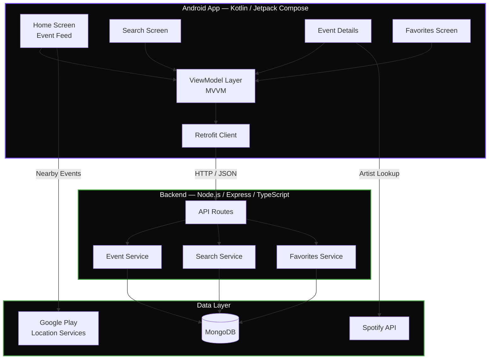

<div align="center">

# EventScout

**Discover events, search artists, save favorites — all from a native Android app.**

[](https://kotlinlang.org/)
[](https://developer.android.com/jetpack/compose)
[](https://nodejs.org/)
[](https://expressjs.com/)
[](https://www.mongodb.com/)
[](https://www.typescriptlang.org/)

[Features](#features) · [Architecture](#architecture) · [Quick Start](#quick-start) · [API Reference](#api-reference) · [Contributing](#contributing)

</div>

---

## About

EventScout is a full-stack event discovery platform with a Node.js/Express backend and a native Android app built with Kotlin and Jetpack Compose. Users can browse curated events, search by keyword or artist, view venue and date details, save favorites, and get location-based recommendations — with optional Spotify integration for artist previews.

---

## Features

| Feature | Description |
|:--------|:------------|
| **Event Discovery** | Browse a curated feed of events on the Home screen |
| **Search** | Find events or artists by keyword with real-time results |
| **Event Details** | View venue, date, artist info, and ticket availability |
| **Favorites** | Save events to a personal favorites list for quick access |
| **Spotify Integration** | View artist profiles and listen to track previews |
| **Location-Based Recommendations** | Get nearby event suggestions using device GPS |

---

## Architecture



### Request Flow

```
┌──────────┐     ┌──────────┐     ┌──────────┐     ┌──────────┐
│ Compose  │────▶│ ViewModel│────▶│ Retrofit │────▶│ Express  │
│ UI       │     │ (MVVM)   │     │ HTTP     │     │ → Mongo  │
└──────────┘     └──────────┘     └──────────┘     └──────────┘
```

---

## Quick Start

### Prerequisites

- **Node.js** 14+
- **MongoDB** (local or Atlas)
- **Android Studio** Koala or newer

### 1. Backend Setup

```bash
cd backend
npm install
```

Create `backend/.env`:

```env
PORT=3000
MONGO_URI=mongodb://localhost:27017/eventscout
```

```bash
npm run dev          # → http://localhost:3000
```

### 2. Android App Setup

1. Open **Android Studio** and select the `android` folder
2. Let Gradle sync and download dependencies
3. Configure the API base URL in `EventFinderService.kt`:
   - Emulator: `http://10.0.2.2:3000/api/`
   - Physical device: `http://<your-local-ip>:3000/api/`
4. Run on an emulator or connected device

---

## Project Structure

```
EventScout/
├── android/                        # Native Android App
│   ├── app/
│   │   ├── src/
│   │   │   └── main/
│   │   │       ├── java/.../
│   │   │       │   ├── network/   # Retrofit service definitions
│   │   │       │   ├── model/     # Data classes
│   │   │       │   ├── viewmodel/ # MVVM ViewModels
│   │   │       │   └── ui/        # Compose screens & components
│   │   │       └── res/           # Drawables, strings, themes
│   │   └── build.gradle.kts       # App-level build config
│   └── build.gradle.kts           # Project-level build config
│
└── backend/                        # Node.js / Express API
    ├── src/
    │   ├── database/              # MongoDB connection logic
    │   └── routes/                # API route handlers
    ├── package.json
    └── tsconfig.json
```

---

## Tech Stack

### Backend

| Layer | Technology |
|:------|:-----------|
| Runtime | Node.js |
| Framework | Express.js |
| Language | TypeScript |
| Database | MongoDB (Mongoose) |
| Config | dotenv |
| Dev Tooling | ts-node-dev, cors |

### Android App

| Layer | Technology |
|:------|:-----------|
| Language | Kotlin |
| UI | Jetpack Compose (Material3) |
| Architecture | MVVM |
| Networking | Retrofit 2 + Gson |
| Image Loading | Coil |
| Navigation | Jetpack Navigation Compose |
| Location | Google Play Services Location |

---

## Contributing

1. Fork the repository
2. Create your feature branch → `git checkout -b feat/amazing-feature`
3. Commit your changes → `git commit -m "feat: add amazing feature"`
4. Push to the branch → `git push origin feat/amazing-feature`
5. Open a Pull Request

---

## License

See [LICENSE](LICENSE) for details.

---

<div align="center">

**[Back to Top](#eventscout)**

</div>
